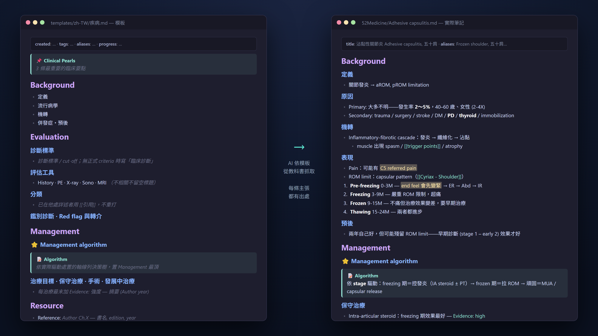

# textbook-to-note

把你自己的 PDF 教科書變成 AI 可搜尋的知識庫，以及結構化、逐條引用的筆記，連圖片一起處理。這是一套本機優先的 pipeline，重活幾乎不花 LLM token，把昂貴的大模型只留給它真正擅長的事：綜合出一份你真的學得進去的筆記。

[English README → README.md](README.md)

## 為什麼做這個

我從醫學生時代就很愛做筆記，這些年累積了幾千份，但已經很難再把每一份都按自己的架構做到相同品質。在資訊越來越多的時代，能信任的高品質來源反而變得珍貴，而教科書就是其中最好的——可是光專科指定參考書就四十多本，同個概念散在好幾本書的不同章節，要全部念過幾乎不可能。LLM 擅長處理長上下文，可是一次丟他幾百本書也不切實際；真正的解法是搭配好的內容搜尋與資料庫，再把我做筆記的流程調教給 AI，讓它有根據、有架構地產出筆記，我只要專心把整理好的高密度資料吸收進腦袋就好。



*左：[`templates/`](templates/) 裡的其中一份模板。右：我 vault 裡照著它寫出來的真實筆記——每條主張都追得到出處，每個段落都在我預期的位置。*

## 為什麼這件事很難（以及為什麼直覺做法會失敗）

把原始 PDF 丟給大模型看似簡單，直到你撞上真正的問題：

- **成本與延遲** — 600 頁的書就是 1-2M token，每次提問都重讀一次撐不住
- **靜默資料遺失** — 掃描頁和壞掉的字型編碼會產生亂碼，模型會安靜地跳過，你永遠不知道筆記少了半章
- **文字錯亂** — 教科書多半雙欄，預設抽取會把左右欄交錯，而「這是亂碼嗎」的簡單檢查會**通過**這種洗牌後的輸出，因為單一字元本身沒問題
- **圖片消失** — 解剖圖、分類表、治療流程圖，往往是一章最精華的部分，文字抽取全部丟掉
- **沒有根據的輸出** — AI 憑記憶寫筆記會產生幻覺，每條主張都得能追溯到來源

這套 pipeline 把上面每一項當成獨立的工程問題，各有刻意的解法，分成五關。

## 五道關卡

### 第一關 · 轉檔 — PDF/EPUB → 乾淨 markdown，0 token

PyMuPDF 文字抽取，每頁約 130 毫秒。三個不那麼直覺的設計：

- **靜默失敗偵測** — 原生文字層會**說謊**（CID/Identity-H 字型、PUA 碼位）。我們用亂碼率、字元密度、字型風險評分，抓出「抽得很順但其實是壞的」頁面，只把這些送去 OCR
- **雙欄閱讀順序** — line-level 欄位分群重建雙欄的真實閱讀順序，並保留 exact-fallback，讓單欄頁面與最單純的抽取結果 byte-identical（`T2N_COLUMN_SORT=0` 可關閉）
- **表格 pass 加閘門** — `pdfplumber` 的表格偵測是轉檔最慢的部分。我們用便宜的 `fitz` 前置檢查（框線特徵含三線表，加上多語 Table/表 關鍵字）先過濾，讓表格稀疏的書轉檔**快約 3.4 倍**又不漏表（`T2N_TABLE_GATE=0` 可關閉）
- **跨頁表格合併** — 課本表格常常跨頁。設 `T2N_TABLE_MERGE=1` 可把「結束在頁面底部」的表格與「下一頁頂端、欄位幾何相符」的表格縫成一張（欄數／欄 x 邊界一致、中間無標題），並去除重複的表頭列，留下 `<!-- table continues from page N -->` 追溯註解。同樣採 exact-fallback：預設關閉時輸出 byte-identical
- **頁框假表格剔除** — 頁面裝飾（內容外框加上頁首橫線）就足以讓 `pdfplumber` 在整頁範圍「找到」一張表：1 欄、整頁文字全部塞進同一個 cell。這種輸出比「漏掉表格」更糟——真正的多欄表格會被壓成一欄、逐行交錯，但標題與每個數值都還在，看起來像乾淨可引用的資料，實際上 row↔column 的對應已經毀了。只有 1 欄、且最大 cell 超過 500 字元，或 bbox 本身就佔半頁以上的候選會被丟棄，並留下 `<!-- ⚠️ page-frame pseudo-table rejected on page N -->` 註解——該頁的正文本來就保有這些文字。實測影響 **128 本書、佔抽出表格的 9.9%**；人工判讀 10 本書共 34 頁的樣本中，28 頁確為缺陷，剩下 6 頁合法的方框清單完全沒有損失（token 100% 都仍在頁面正文中）。預設**開啟**（這是修正錯誤輸出，不是新功能）；`T2N_TABLE_FRAME_REJECT=0` 可還原舊行為
- **整本書表格失敗偵測** — 表格遺失是雙峰分布：一本書要嘛抽得好好的，要嘛整本無聲全滅。若 `pdfplumber` 讀到 0 頁而 `fitz` 開得起來，或整本有 ≥10 個表格 caption 卻抽出 0 張表，轉檔報告與 markdown 本身都會出現明確警告，而不是什麼都沒有。純偵測，不改變抽取行為。在本語料庫 34 本零表格書中觸發 22 本，226 本正常抽表的書則一本都不誤報（`T2N_BOOK_TABLE_CHECK=0` 可關閉）

掃描頁會落入 **OCR 階梯** — Surya → PaddleOCR-VL → 本地視覺模型 → 大模型視覺（真正的最後手段）— 逐頁選擇，不把整本書押在單一方法。詳見 [`docs/ocr-ladder.md`](docs/ocr-ladder.md)，內含**硬體分級的模型選擇表**（無 GPU／Apple Silicon／NVIDIA 8GB／16GB+），讓你按自己的 VRAM 選引擎與 ollama 模型，而不是轉到一半 OOM。

### 第二關 · 切塊 — 切成可語意搜尋的單位

目錄（index）太粗（一個主題橫跨多章）；手動 tag 維護不完也切不夠細。答案是**語意 embedding**。但切塊是設計決策，不是固定視窗：切太小失去脈絡，切太大稀釋語意。我們**照標題結構切塊**，並帶上每塊的上層章節脈絡，讓撈回來的每一塊都是有出處、自成一體的完整概念。

### 第三關 · 檢索 — 在幾十本書裡找到對的那本

跨書搜尋跑在與姊妹專案 [**vault-search**](https://github.com/drpwchen/vault-search) 相同的引擎上 — 本地 LanceDB + `bge-m3` embeddings，資料不出你的電腦。在單純相似度之上，我們加了**來源加權**：把你最信任的參考書（考試指定用書、學會官方教科書）分數調高，並依版本新舊調整，讓 AI 在任何主題上優先取用**你**信任的來源。

### 第四關 · 撰寫 — 一套筆記演算法，不只是一段 prompt

筆記品質來自流程，不是模型：

- **先盲寫** — AI 先完整地從教科書 corpus 查完資料，**才**去看既有筆記，讓舊筆記的結構與內容無法干擾新草稿，合併放在最後
- **Template 驅動抓取** — 每種主題有固定模板。這是關鍵：它告訴 AI 該去書裡找什麼，也讓每份筆記形狀一致，讓**你**讀得更快。像開頭的 Summary、Management algorithm 這種段落，存在本身就是為了幫助理解，不只是放資料。每天實際使用的模板收在 [`templates/`](templates/)，含原始繁體中文版與英文翻譯
- **沒有引用就不算數** — 每條主張都帶書名＋章節；AI 用自己知識補的一律標記為推論
- **非破壞性合併** — 覆寫既有筆記前，會先確認你的 vault 有版本控制，否則改成在旁邊寫 draft，絕不靜默蓋掉你手寫的筆記

詳見 [`workflows/note-writing.md`](workflows/note-writing.md)。

### 第五關 · 抽圖片 — 最難的一關

每本書的圖片排版邏輯都不同，沒有單一裁切規則。我們用**通用的幾何比對方法**（圖說認領最近的可指派圖像），後面接一道**決定論 QC 閘門**：留白填充、文字滲入、OCR 長行檢查，全部在任何 AI 判斷之前先跑，而且閘門**寧可 hard-fail 也不亂猜**，所以指錯頁碼會得到拒絕而不是錯圖。全程在本機、省 token 執行。

當某本書抽錯時，你修正**那本書**的邏輯一次，之後從它抽的每張圖都正確。這一關迭代過很多版，目前仍屬**實驗性質**，還無法涵蓋所有書，非常歡迎改良 PR。詳見 [`figures/CALIBRATION.md`](figures/CALIBRATION.md)。

### Bonus · 可插拔的證據補充

筆記流程有選用的 hook 點，可從外部來源補強草稿 — 臨床實證 API、給付／規範資料庫、文獻搜尋。為了控制專案規模，這些放在本 repo 之外；流程文件標明它們接入的位置，讓你接上自己領域的來源。

其中我每天在用的臨床實證 hook 另外開源成 [**openevidence-tools**](https://github.com/drpwchen/openevidence-tools)：一組 OpenEvidence 提問工具，加上一個檢查回傳引用的 verify 工具。它的參考來源是 [htlin222/openevidence-mcp](https://github.com/htlin222/openevidence-mcp)，不是 fork。提醒**一定要跑 verify**，引用是會出錯的。

## 設計成讓 AI 幫你部署

你大概是想讓**你的** AI 來裝這套，這正是預設路徑：

> 把 Claude Code（或任何有能力的 coding agent）指到這個 repo，說：
> **「讀 AGENTS.md，幫我把它裝起來。」**

[`AGENTS.md`](AGENTS.md) 是寫給 agent 看的：裝依賴、設定、轉第一本書、安裝兩個 Claude Code skill、跑筆記流程，還有 token 護欄，避免天真的 agent 把整本書讀進 context 燒掉上百萬 token。

## 目錄結構

```
converter/    PDF/EPUB → markdown（convert.py — 靜默失敗偵測＋雙欄排序＋表格閘門）
figures/      圖片抽取 + 決定論 QC 閘門（進入點 figure_remap.py）
skills/       可直接放入 Claude Code 的 skill 定義（textbook-to-md、figure-remap）
workflows/    筆記撰寫演算法（可改造成你自己的筆記系統）
docs/         架構、OCR 階梯 + 硬體分級模型表
examples/     目標筆記格式範例
shared/       環境變數驅動的設定（config.py）
```

## 需求

- Python 3.10+，`pip install -r requirements.txt`
- **純 CPU 是一等公民路徑**（數位原生 PDF，最常見的情況），不需要 GPU
- 選用（處理掃描書與圖片 QC）：NVIDIA GPU 或 Apple Silicon + [Surya OCR](https://github.com/VikParuchuri/surya)、[ollama](https://ollama.com) 加小視覺模型與 `bge-m3` embeddings，全部本機執行，資料不出你的電腦。見 [`docs/ocr-ladder.md`](docs/ocr-ladder.md) 的硬體分級表
- 在 Windows 11 與 macOS 上測試過；Windows 特有的坑都在程式碼裡處理掉了（cp950 subprocess 解碼、路徑操作）

## 設計哲學

- **本機優先、省 token** — 昂貴的 AI 只留給綜合，絕不拿來逐頁讀書
- **決定論的關卡，不靠 AI 感覺** — 每張圖、每個 OCR 頁面都先過規則式 QC，AI 才有資格判斷，而且閾值**永遠不為了讓失敗案例過關而調整**
- **沒有引用就不算數** — 每條主張都追溯到書＋章節；AI 推論的內容明確標記

## 請用你自己的書

這個工具**不含任何教科書內容**。它處理你已擁有的 PDF：買的電子書、機構授權下載、開放授權教材（[OpenStax](https://openstax.org)），或在當地法律允許下自己掃描的紙本書。請尊重書籍的授權條款。

## 相關專案

- [**vault-search**](https://github.com/drpwchen/vault-search) — 第三關所基於的本地語意搜尋引擎
- [**openevidence-tools**](https://github.com/drpwchen/openevidence-tools) — 接在 Bonus 關的 OpenEvidence 提問 + verify 工具組

## 授權

MIT © 陳柏威 Po-Wei Chen（[drpwchen](https://github.com/drpwchen)）
